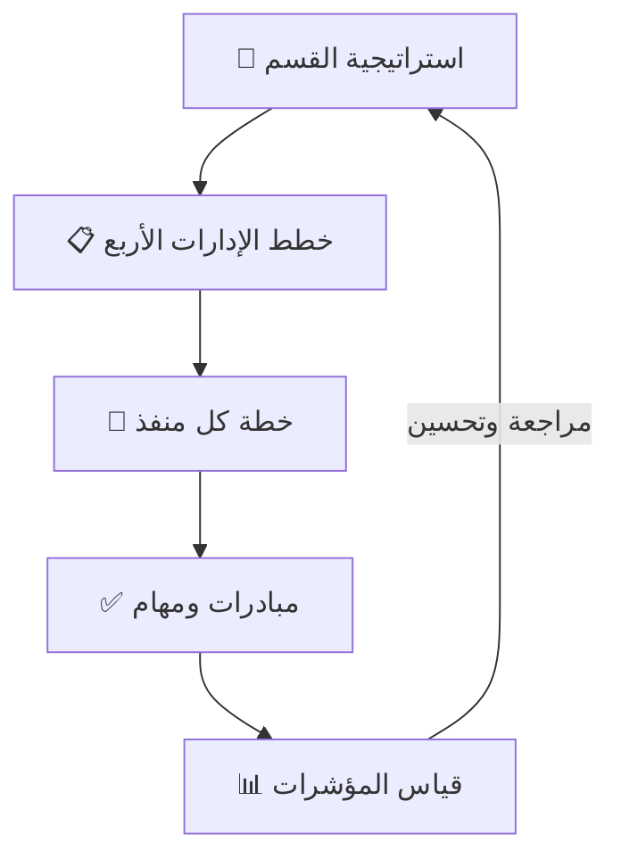

# آلية التنفيذ والحوكمة

كيف نحوّل [الاستراتيجية](strategy.md) إلى نتائج: التدرّج، الأدوار، الإيقاع، والقياس.

---

## 1. تدرّج الاستراتيجية (Cascade)



الاستراتيجية العليا تتفرّع إلى خطط إدارات، ثم إلى خطة لكل منفذ **تبدأ من
[دراسة وتحليل الموقع](site-study.md)**، ثم إلى مبادرات ومهام قابلة للقياس،
وتعود نتائجها لمراجعة الاستراتيجية.

## 2. الأدوار والمسؤوليات (RACI)

> R = ينفّذ · A = مُساءل · C = يُستشار · I = يُبلَّغ

| النشاط | رئيس القسم | مدير الإدارة | مدير المنفذ | التسويق | الشراكات |
|--------|:---------:|:-----------:|:-----------:|:-------:|:--------:|
| وضع الاستراتيجية والمستهدفات | A | C | I | C | C |
| خطة الإدارة | A | R | C | C | C |
| خطة المنفذ | I | C | R | C | C |
| تنفيذ المبادرات | I | A | R | R | R |
| قياس المؤشرات والتقارير | A | R | R | C | C |

_(الأدوار مبدئية — نضبطها حسب هيكلكم الفعلي.)_

## 3. الإيقاع التشغيلي (Cadence)

| الدورية | النشاط | المخرج |
|---------|--------|--------|
| **سنوي** | مراجعة الاستراتيجية ووضع المستهدفات | خطة سنوية معتمدة |
| **ربعي** | مراجعة الأداء وتعديل المبادرات | تقرير ربعي + تحديث الخطط |
| **شهري** | متابعة المؤشرات لكل منفذ | لوحة أداء شهرية |
| **أسبوعي** | متابعة تنفيذ المبادرات | قائمة مهام محدّثة |

## 4. دورة حياة المبادرة

```
اقتراح → تقييم واعتماد → تخطيط → تنفيذ → قياس → مراجعة (توسيع / تعديل / إيقاف)
```

كل مبادرة تُسجَّل في خطة الإدارة أو المنفذ بمسؤول وجدول زمني ومؤشر ومستهدف.

## 5. القياس والتقارير

- لكل محور مؤشراته المعرّفة في [الإطار](framework.md#4-محاور-العمل-والمؤشرات).
- خط الأساس ثم المتابعة الدورية لكل منفذ (القسم 2 و5 في ملف المنفذ).
- **التكامل مع «درب»:** يمكن سحب مؤشرات التطبيق وتانكي والحملات وخدمة العملاء
  آلياً لتغذية اللوحات بدل الإدخال اليدوي.

## 6. قالب المراجعة الربعية

- ما تحقّق مقابل المستهدف (لكل محور ومنفذ).
- الفجوات وأسبابها.
- قرارات: مبادرات تُوسَّع / تُعدَّل / تُوقَف.
- مستهدفات الربع القادم.

## 7. اتخاذ القرار والتصعيد

- قرارات ضمن حدود صلاحية كل إدارة تُتخذ داخلها.
- ما يتجاوز الحدود (استثمار، تسعير كبير، شراكة كبرى) يُصعَّد لرئيس القسم.
- _(نحدّد الحدود الرقمية مع اعتماد الاستراتيجية.)_

## 8. الأدوات ومصدر الحقيقة

هذا المستودع هو **المصدر الموحّد**: الاستراتيجية (`docs/`)، خطط الإدارات
(`divisions/`)، وخطط المنافذ (`outlets/`) — يُحدَّث ويُراجَع دورياً.
