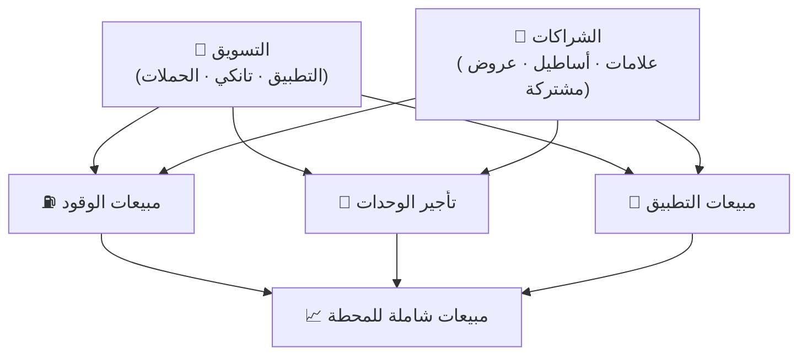

# الإطار الاستراتيجي للقسم التجاري

## 1. الغرض

توحيد طريقة بناء ومتابعة الاستراتيجية التجارية عبر جميع المنافذ (المحطات)،
بحيث يكون لكل منفذ **خطة بيع شاملة** قابلة للقياس، تتكامل فيها محركات البيع
الثلاثة مع طبقتَي الدعم (التسويق والشراكات)، ضمن إطار موحّد يربط إدارات القسم
بمحاور العمل.

---

## 2. نموذج العمل الاستراتيجي

**الفكرة المحورية: مبيعات شاملة لكل محطة** — ثلاث خطط بيع متكاملة، تدعمها
طبقتا التسويق والشراكات، لترفع إجمالي إيراد المنفذ.

### محركات المبيعات الثلاثة (خطط البيع)

1. ⛽ **خطة مبيعات الوقود** — رفع أحجام بيع البنزين/الديزل والهوامش.
2. 🏪 **خطة التأجير** — تغطية **جميع الوحدات الشاغرة** بمستأجرين يناسبون
   **احتياجات الموقع**، بما يضمن **استدامة المستأجر** — لا مجرد ملء الفراغ.
3. 📱 **خطة التطبيق** — تنمية المبيعات الرقمية عبر تطبيق «درب».

### طبقتا الدعم (تدعمان الجميع في البيع)

- 📣 **التسويق** — بأدواته (التطبيق، تانكي، الحملات والعروض): ترويج وولاء
  وبيع متقاطع يرفع الوقود والتأجير والمعاملات الرقمية.
- 🤝 **الشراكات** — علامات وامتيازات للتأجير، أساطيل وحسابات مؤسسية للوقود،
  وعروض/شركاء مشتركين للتطبيق وتانكي.

### الهدف المتكامل لكل منفذ

- 📈 ارتفاع مبيعات البنزين.
- 🏬 تغطية كل الوحدات الشاغرة بما يناسب احتياجات الموقع ويضمن استدامة المستأجر.
- 🔗 تفعيل التطبيق والمكافآت والتسويق والشراكات لدعم كل عمليات البيع في المحطة.

---

## 3. الهيكل التنظيمي للقسم

يتكوّن **القسم التجاري** من أربع إدارات، تفاصيلها في مجلد [`divisions/`](../divisions/):

| الإدارة | المسؤولية | المحور/المحاور |
|---------|-----------|------------------|
| **إدارة مبيعات الوقود** | أحجام البيع، الهوامش، التسعير، خدمة المضخات | ⛽ مبيعات الوقود |
| **إدارة التأجير** | الإشغال، العقود، مزيج المستأجرين، الإيراد الإيجاري | 🏪 تأجير الوحدات |
| **إدارة الشراكات** | تحالفات العلامات والأساطيل والعروض المشتركة | 🤝 الشراكات (تُغذّي الجميع) |
| **إدارة التسويق** | المبيعات الرقمية عبر التطبيق، ولاء «تانكي»، الحملات | 📱 التطبيق + 🎁 تانكي |

> التسويق والشراكات يعملان كطبقتَي **دعم** لبقية محركات البيع (الوقود والتأجير
> والتطبيق)، إضافةً لإدارة مهامهما المباشرة.

---

## 4. محاور العمل والمؤشرات

### ⛽ المحور 1: مبيعات الوقود — *إدارة مبيعات الوقود*

- **التعريف:** بيع الوقود (بنزين/ديزل) في المحطة.
- **أهداف نموذجية:** رفع أحجام البيع، تحسين الهامش، رفع معدل التحويل
  (مرور → تعبئة)، إدارة التسعير التنافسي.
- **مؤشرات رئيسية (KPIs):**
  - حجم المبيعات (لتر/يوم، لتر/شهر)
  - متوسط قيمة التعبئة
  - الهامش لكل لتر
  - حصة السوق المحلية (مقابل المنافسين المجاورين)
  - توزيع مبيعات ساعات الذروة

### 🏪 المحور 2: تأجير الوحدات — *إدارة التأجير*

- **التعريف:** تأجير الوحدات/المساحات التجارية داخل المنفذ (متاجر، مطاعم،
  غسيل، صرّاف آلي، أكشاك...).
- **مبدأ توجيهي:** تغطية الشواغر تكون **مدروسة حسب احتياجات الموقع** لضمان
  **استدامة المستأجر** — نختار النشاط الذي يخدم زوّار المنفذ ويبقى قابلاً
  للحياة تجارياً، لا مجرد ملء الفراغ.
- **أهداف نموذجية:** رفع نسبة الإشغال، تنويع المستأجرين، رفع الإيراد لكل متر
  مربع، تحسين مزيج العلامات الجاذب للزوّار.
- **مؤشرات رئيسية:**
  - نسبة الإشغال (%)
  - الإيراد الإيجاري (شهري/سنوي)
  - الإيراد لكل م²
  - عدد الوحدات المؤجّرة/الشاغرة
  - معدل تجديد العقود ومتوسط مدة العقد

### 🤝 المحور 3: الشراكات — *إدارة الشراكات*

- **التعريف:** بناء تحالفات تجارية تُغذّي محركات البيع (علامات وامتيازات
  للتأجير، أساطيل وحسابات مؤسسية للوقود، عروض وشركاء مشتركين للتطبيق وتانكي).
- **أهداف نموذجية:** زيادة عدد الشراكات النشطة، رفع الحجم/الإيراد المُولّد من
  الشراكات، تغذية التأجير بعلامات مستدامة، ورفع أحجام الوقود عبر عقود الأسطول.
- **مؤشرات رئيسية:**
  - عدد الشراكات النشطة
  - عدد شركاء العلامات/الامتيازات
  - عدد عقود الأسطول/الشركات وأحجامها
  - الإيراد/الحجم المُولّد من الشراكات
  - خط أنابيب الشراكات المحتملة

### 📱 المحور 4: المبيعات عبر التطبيق (درب) — *إدارة التسويق*

- **التعريف:** تنمية ودعم مبيعات المنفذ عبر تطبيق «درب» (تعبئة، منتجات، دفع
  رقمي، خدمات).
- **أهداف نموذجية:** رفع نسبة المعاملات الرقمية، زيادة المستخدمين النشطين،
  رفع متوسط قيمة الطلب وتكرار الشراء.
- **مؤشرات رئيسية:**
  - عدد المستخدمين النشطين المرتبطين بالمنفذ
  - نسبة المعاملات عبر التطبيق من إجمالي المعاملات
  - متوسط قيمة الطلب (AOV)
  - تكرار الشراء
  - معدل التحويل داخل التطبيق (للعروض/الحملات)

### 🎁 المحور 5: برنامج مكافآت تانكي — *إدارة التسويق*

- **التعريف:** برنامج الولاء «تانكي» الذي يكافئ العملاء على مشترياتهم ويعزّز
  تكرار الزيارة، ويُستخدم كأداة لدعم البيع عبر كل المحاور.
- **أهداف نموذجية:** اكتساب أعضاء جدد، رفع نسبة الأعضاء النشطين، رفع معدل
  الاستبدال، تحسين الاحتفاظ وحصة مبيعات الأعضاء.
- **مؤشرات رئيسية:**
  - عدد الأعضاء ومعدل الاكتساب
  - نسبة الأعضاء النشطين
  - النقاط المكتسبة مقابل المستبدلة
  - معدل الاستبدال (Redemption Rate)
  - معدل الاحتفاظ (Retention)
  - حصة مبيعات الأعضاء من إجمالي مبيعات المنفذ

---

## 5. خريطة الربط: الإدارة ← المحور ← ملف المنفذ

| الإدارة | المحور | القسم المقابل في ملف المنفذ |
|---------|--------|------------------------------|
| إدارة مبيعات الوقود | ⛽ مبيعات الوقود | 4.1 |
| إدارة التأجير | 🏪 تأجير الوحدات | 4.2 |
| إدارة الشراكات | 🤝 الشراكات | 4.3 |
| إدارة التسويق | 📱 المبيعات عبر التطبيق | 4.4 |
| إدارة التسويق | 🎁 مكافآت تانكي | 4.5 |

---

## 6. دورة بناء استراتيجية المنفذ

1. **بطاقة المنفذ:** توصيف المنفذ وخصائصه.
2. **خط الأساس:** جمع المؤشرات الحالية عبر المحاور.
3. **التحليل:** SWOT + قراءة الفجوات والفرص.
4. **الأهداف:** أهداف SMART ومستهدفات ربعية لكل محور.
5. **المبادرات:** خطة تنفيذ بمسؤول وجدول زمني.
6. **المتابعة:** مراجعة دورية وتحديث المؤشرات.

---

## 7. مستويات الاستراتيجية

- **مستوى القسم:** توجهات وأهداف عامة تشمل كل المنافذ.
- **مستوى الإدارة:** خطة كل إدارة من الإدارات الأربع (مجلد `divisions/`).
- **مستوى المنفذ:** خطة بيع شاملة مخصّصة لكل محطة (مجلد `outlets/`).

---

## 8. المصادر والتكامل

يمكن لاحقاً ربط خطوط الأساس والمؤشرات ببيانات نظام «درب» (الحملات، خدمة
العملاء، لوحات المتابعة) لتحديثها آلياً بدل الإدخال اليدوي.
