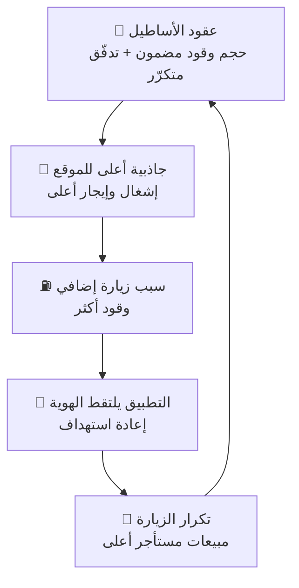

# استراتيجية التكامل بين إدارات القسم التجاري

> **الغرض:** كيف تعمل إدارات (⛽ مبيعات الوقود · 🏪 التأجير · 🤝 الشراكات · 📣 التسويق) كوحدة واحدة بدل أربع خطط متوازية.
> **الحالة:** مقترح للاعتماد · **آخر تحديث:** 2026-07-25

---

## 1. المشكلة

الإدارات الأربع تبيع **لنفس العميل، في نفس الموقع، في نفس الزيارة** — لكن كل إدارة تُقاس بمقياس منفصل:

| الإدارة | مقياسها اليوم | ما تحسّنه |
|---|---|---|
| ⛽ الوقود | اللترات | الحجم |
| 🏪 التأجير | الإشغال | الإيجار |
| 🤝 الشراكات | عدد العقود | الاتفاقيات |
| 📣 التسويق | الحملات والوصول | الظهور |

**النتيجة:** تنسيق شكلي بلا تكامل حقيقي، ولا أحد مسؤول عن **ربح المحطة الكامل**.

**التكامل لا يُصنع باجتماعات — يُصنع بإعادة تعريف وحدة القياس والحوافز.**

---

## 2. الفكرة المركزية

> **الوقود يجلب الحركة · غير الوقود يصنع الربح · التطبيق يربطهما · المندوب ينفّذها**

**وحدة القياس الجديدة: الربح لكل زيارة (Profit per Visit) في كل منفذ.**

### المبرّر الاقتصادي (نموذج MK007)

| البند | القيمة |
|---|---|
| الزيارات | ~128,000 زيارة/شهر |
| هامش الوقود | ~4.6 ر.س لكل زيارة — **مُقنَّن، خارج سيطرتنا** |
| أثر رفع غير الوقود **1 ر.س/زيارة** | **+128,000 ر.س/شهر** في محطة واحدة |

> هامش الوقود سقفه محدود تنظيمياً؛ **مساحة النمو الحقيقية في غير الوقود** — وهي بطبيعتها تتطلّب تكامل الإدارات الأربع.
> *(الأرقام مبنية على بيانات MK007 الفعلية وافتراضات النموذج المالي — تُعتمد بعد المراجعة.)*

---

## 3. الركائز الهيكلية الثلاث

### 3.1 مالك منفذ واحد (P&L Owner)
- شخص واحد مسؤول عن **الربح الكامل للمحطة**.
- الإدارات الأربع = **خدمات مشتركة** تخدم مالك المنفذ.
- يعتمد أي التزام سعري أو تعاقدي يخصّ محطته.

> هذا أكبر إصلاح هيكلي: اليوم **لا أحد يملك ربح المحطة**.

### 3.2 بطاقة أداء موحّدة
لكل منفذ بطاقة واحدة تجمع:

| النوع | المؤشر | الغرض |
|---|---|---|
| مؤشر الإدارة | لترات · إشغال · عقود · حملات | المساءلة الوظيفية |
| **مؤشر مشترك** | **الربح/الزيارة · عدد الزيارات · حصة التطبيق · ربح المنفذ** | **التكامل** |

### 3.3 حوافز مشتركة — *هنا يتحقّق التكامل فعلياً*

```
٦٠٪ على هدف الإدارة  +  ٤٠٪ على ربح المنفذ المشترك
```

> ما لم يُدفع الحافز على النتيجة المشتركة، سيبقى كل قسم يحمي رقمه على حساب الربح الكلي.

---

## 4. دورة النمو (الآلية التشغيلية)



**كل دورة ترفع الربح لكل زيارة.** هذه هي الآلية التي تُدار بها المحطة، لا الخطط المنفصلة.

---

## 5. أدوات البيع — الاستخدام الاستراتيجي

### 5.1 📱 التطبيق = العمود الفقري للتكامل (وليس قناة تسويق)

**الوضع:** حصة الدفع عبر التطبيق **0.6٪** — وهذا **القيد الملزم للاستراتيجية كلها**.
بدون هوية العميل: لا قياس للتكامل، ولا استهداف، ولا إثبات لأثر أي مبادرة.

**ما ينفرد به التطبيق:**
| الوظيفة | الأثر التكاملي |
|---|---|
| تحويل زيارة نقدية مجهولة → عميل معروف | يربط الوقود بالتجزئة بالولاء |
| منح المستأجر قناة تسويق **يدفع مقابلها** | **سطر إيراد جديد** للقسم |
| منح الأسطول بطاقات وتقارير استهلاك | **عقود أصعب في الفقدان** |

> **قاعدة إلزامية:** كل خطة في أي إدارة يجب أن تتضمّن «خُطّاف تطبيق» — وإلا لا تُعتمد.

### 5.2 👥 المندوب المباشر = مندوب منفذ متكامل (لا مندوب منتج)

**إعادة تعريف الإقليم:** نطاق المحطة الجغرافي — لا خط المنتج.

زيارة واحدة لجار تجاري تُنتج **أربع فرص**:
1. ⛽ عقد وقود أسطول
2. 🏪 مستأجر محتمل
3. 🤝 شريك حملة
4. 📱 تفعيل تطبيق

> يضاعف إنتاجية **نفس عدد الموظفين** بلا زيادة في التكلفة.

---

## 6. قواعد فضّ التعارض

| التعارض | القاعدة الحاكمة |
|---|---|
| التسويق يريد خصماً · الوقود يحمي الهامش | الخصم يُموَّل من هامش **غير الوقود** أو ميزانية الشريك — **لا من هامش الوقود** |
| التأجير يريد أعلى إيجار · الوقود يريد جاذب حركة | اختيار المستأجر يُقيَّم على **(الإيجار + مساهمته في الحركة)** — لا الإيجار وحده |
| الشراكات تعد بأسعار · التشغيل يتحمّلها | أي التزام سعري يمرّ باعتماد **مالك المنفذ** |
| تعارض محطتين متجاورتين على نفس العميل | تُدار المنطقة كمحفظة واحدة لتفادي **التغذية الذاتية** |

---

## 7. التسلسل التنفيذي

| المرحلة | التركيز | المبرّر |
|---|---|---|
| **٠–٣ أشهر**<br/>*التأسيس* | مالك منفذ · بطاقة أداء موحّدة · **تفعيل التطبيق عند المضخة** | البنية التحتية للقياس؛ التطبيق يفتح كل ما بعده |
| **٣–٦ أشهر**<br/>*ملء الطاقة* | تغطية **الوحدات الشاغرة** بما يناسب الموقع · **عقود الأساطيل** | أكبر مجمّعَي إيراد جاهزَين فوراً |
| **٦–١٢ شهراً**<br/>*تسييل الدورة* | المستأجر يشتري وصولاً للتطبيق · عروض مجمّعة · تسعير بالشريحة | هنا يتحوّل التكامل إلى ربح |

> **نقطة البداية:** تفعيل التطبيق — لأنه القيد الذي يعطّل قياس كل شيء آخر.

---

## 8. مؤشرات نجاح التكامل (للاعتماد)

| المؤشر | القياس | الملكية |
|---|---|---|
| الربح لكل زيارة | إجمالي ربح المنفذ ÷ الزيارات | مالك المنفذ |
| حصة التطبيق من المعاملات | معاملات التطبيق ÷ الإجمالي | 📣 التسويق |
| نسبة الوحدات المشغولة | مشغولة ÷ إجمالي | 🏪 التأجير |
| حجم الأساطيل المتعاقد | لتر/شهر بعقود | 🤝 الشراكات |
| تغطية غير الوقود للمصاريف | (إيجار + خدمات) ÷ المصاريف | مالك المنفذ |
| نسبة الإيجار إلى مبيعات المستأجر | إيجار ÷ مبيعات (صحّي ≤ 15٪) | 🏪 التأجير |

---

## 9. الارتباط بالوثائق الأخرى

| الوثيقة | العلاقة |
|---|---|
| [`framework.md`](framework.md) | الإطار والمحاور الخمسة — هذه الوثيقة تضيف **آلية التكامل** بينها |
| [`strategy.md`](strategy.md) | الرؤية والأهداف العليا |
| [`tracking-system.md`](tracking-system.md) | بطاقة الأداء التي تُطبَّق عليها المؤشرات المشتركة |
| [`../platform/`](../platform/) | المنصّة التفاعلية التي تعرض المؤشرات على مستوى المحفظة وكل منفذ |
